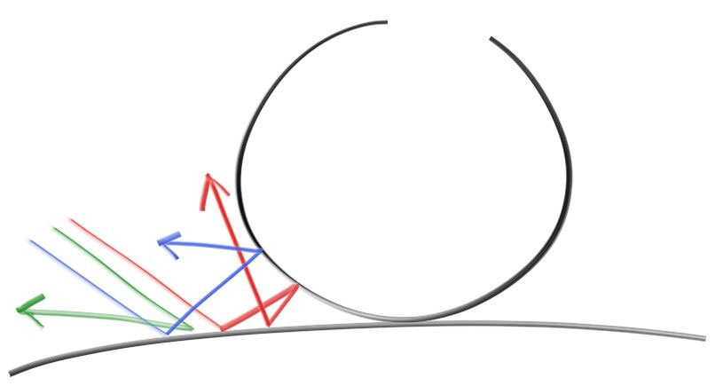
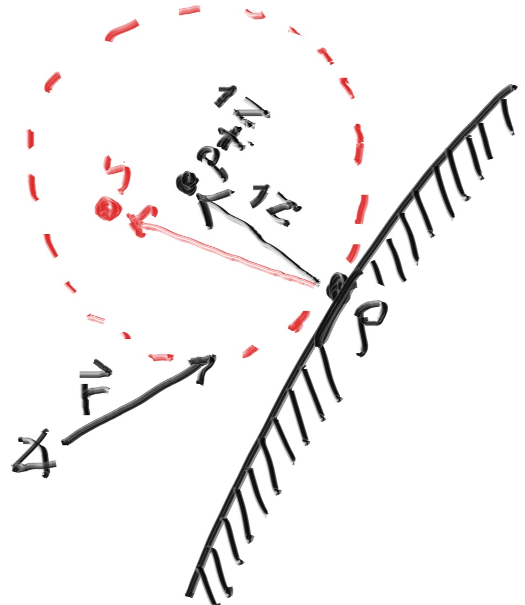
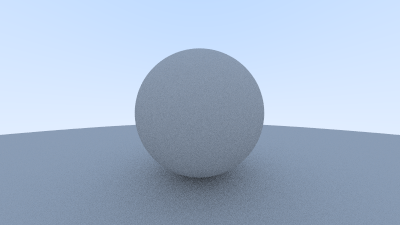
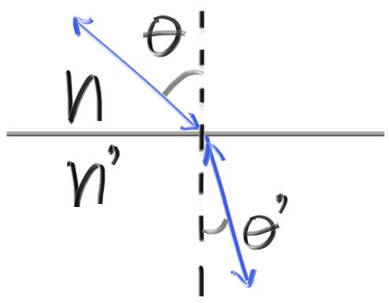

# MyRayTracing

学习[Ray tracing in one weekend &amp; next week](https://raytracing.github.io/books/RayTracingInOneWeekend.html) 后做出的年轻人第一款软光追


## **输出你的图像**

本项目文件输出格式采用 PPM格式文件 


```cpp
#ifndef COLOR_H
#define COLOR_H

#include "vec3.h"

#include <iostream>

void write_color(std::ostream& out, color pixel_color, int samples_per_pixel) {
    auto r = pixel_color.x();
    auto g = pixel_color.y();
    auto b = pixel_color.z();

    // Divide the color by the number of samples and gamma-correct for gamma=2.0.
    auto scale = 1.0 / samples_per_pixel;
    r = sqrt(scale * r);
    g = sqrt(scale * g);
    b = sqrt(scale * b);

    // Write the translated [0,255] value of each color component.
    out << static_cast<int>(256 * clamp(r, 0.0, 0.999)) << ' '
        << static_cast<int>(256 * clamp(g, 0.0, 0.999)) << ' '
        << static_cast<int>(256 * clamp(b, 0.0, 0.999)) << '\n';
}
#endif
```

## `vec3`类

用一个vec3类来储存所有的颜色, 位置, 方向, 位置偏移等信息

```cpp
#ifndef VEC3_H
#define VEC3_H

#include <cmath>
#include <iostream>

using std::sqrt;

class vec3 {
public:
    vec3() : e{ 0,0,0 } {}
    vec3(double e0, double e1, double e2) : e{ e0, e1, e2 } {}

    double x() const { return e[0]; }
    double y() const { return e[1]; }
    double z() const { return e[2]; }

    vec3 operator-() const { return vec3(-e[0], -e[1], -e[2]); }
    double operator[](int i) const { return e[i]; }
    double& operator[](int i) { return e[i]; }

    vec3& operator+=(const vec3& v) {
        e[0] += v.e[0];
        e[1] += v.e[1];
        e[2] += v.e[2];
        return *this;
    }

    vec3& operator*=(const double t) {
        e[0] *= t;
        e[1] *= t;
        e[2] *= t;
        return *this;
    }

    vec3& operator/=(const double t) {
        return *this *= 1 / t;
    }

    double length() const {
        return sqrt(length_squared());
    }

    double length_squared() const {
        return e[0] * e[0] + e[1] * e[1] + e[2] * e[2];
    }

    inline static vec3 random() {
        return vec3(random_double(), random_double(), random_double());
    }

    inline static vec3 random(double min, double max) {
        return vec3(random_double(min, max), random_double(min, max), random_double(min, max));
    }

    bool near_zero() const {
        // Return true if the vector is close to zero in all dimensions.
        const auto s = 1e-8;
        return (fabs(e[0]) < s) && (fabs(e[1]) < s) && (fabs(e[2]) < s);
    }

public:
    double e[3];
};

// vec3 Utility Functions

inline std::ostream& operator<<(std::ostream& out, const vec3& v) {
    return out << v.e[0] << ' ' << v.e[1] << ' ' << v.e[2];
}

inline vec3 operator+(const vec3& u, const vec3& v) {
    return vec3(u.e[0] + v.e[0], u.e[1] + v.e[1], u.e[2] + v.e[2]);
}

inline vec3 operator-(const vec3& u, const vec3& v) {
    return vec3(u.e[0] - v.e[0], u.e[1] - v.e[1], u.e[2] - v.e[2]);
}

inline vec3 operator*(const vec3& u, const vec3& v) {
    return vec3(u.e[0] * v.e[0], u.e[1] * v.e[1], u.e[2] * v.e[2]);
}

inline vec3 operator*(double t, const vec3& v) {
    return vec3(t * v.e[0], t * v.e[1], t * v.e[2]);
}

inline vec3 operator*(const vec3& v, double t) {
    return t * v;
}

inline vec3 operator/(vec3 v, double t) {
    return (1 / t) * v;
}

inline double dot(const vec3& u, const vec3& v) {
    return u.e[0] * v.e[0]
        + u.e[1] * v.e[1]
        + u.e[2] * v.e[2];
}

inline vec3 cross(const vec3& u, const vec3& v) {
    return vec3(u.e[1] * v.e[2] - u.e[2] * v.e[1],
        u.e[2] * v.e[0] - u.e[0] * v.e[2],
        u.e[0] * v.e[1] - u.e[1] * v.e[0]);
}

inline vec3 unit_vector(vec3 v) {
    return v / v.length();
}

vec3 random_in_unit_sphere() {
    while (true) {
        auto p = vec3::random(-1, 1);
        if (p.length_squared() >= 1) continue;
        return p;
    }
}

vec3 random_unit_vector() {
    return unit_vector(random_in_unit_sphere());
}

vec3 random_in_hemisphere(const vec3& normal) {
    vec3 in_unit_sphere = random_in_unit_sphere();
    if (dot(in_unit_sphere, normal) > 0.0) // In the same hemisphere as the normal
        return in_unit_sphere;
    else
        return -in_unit_sphere;
}

vec3 random_in_unit_disk() {
    while (true) {
        auto p = vec3(random_double(-1, 1), random_double(-1, 1), 0);
        if (p.length_squared() >= 1) continue;
        return p;
    }
}

vec3 reflect(const vec3& v, const vec3& n) {
    return v - 2 * dot(v, n) * n;
}

vec3 refract(const vec3& uv, const vec3& n, double etai_over_etat) {
    auto cos_theta = fmin(dot(-uv, n), 1.0);
    vec3 r_out_perp = etai_over_etat * (uv + cos_theta * n);
    vec3 r_out_parallel = -sqrt(fabs(1.0 - r_out_perp.length_squared())) * n;
    return r_out_perp + r_out_parallel;
}

// Type aliases for vec3
using point3 = vec3;   // 3D point
using color = vec3;    // RGB color

#endif
```

## `ray`类

所有的光线追踪器都有个一个ray类, 我们假定光线的公式为$\mathbf{p}(t) = \mathbf{a} + t \vec{\mathbf{b}}$。这里的$p$是三维射线上的一个点。$a$是射线的原点, $\vec{\mathbf{b}}$是射线的方向。类中的变量$t$是一个实数(代码中为double类型)。$p(t)$接受任意的$t$做为变量, 返回射线上的对应点。如果允许$t$取负值你可以得到整条直线。对于一个正数$t$, 你只能得到原点前部分$a$, 这常常被称为半条直线, 或者说射线。


```cpp
#ifndef RAY_H
#define RAY_H

#include "vec3.h"

class ray {
public:
    ray() {}
    ray(const point3& origin, const vec3& direction, double time = 0.0)
        : orig(origin), dir(direction), tm(time)
    {}

    point3 origin() const { return orig; }
    vec3 direction() const { return dir; }
    double time() const { return tm; }

    point3 at(double t) const {
        return orig + t * dir;
    }

public:
    point3 orig;
    vec3 dir;
    double tm;
};

#endif
```

## `Camera`类

现在我们再拐回来做我们的光线追踪器。光线追踪器的核心是从`pixel`发射射线, 并计算这些射线得到的颜色。这包括如下的步骤:

1. 计算从`eye`到`pixel`的射线
2. 计算光线是否与场景中的物体相交，与哪个物体相交？
3. 如果有, 计算交点的颜色。

在做光线追踪器的初期, 我会先弄个简单摄像机让代码能跑起来。我也会编写一个简单的`ray_color(ray)`函数来返回背景颜色值(一个简单的渐变色)。

`eye`or`Camera`的摆放遵循图形学典中典摆放方式——右手坐标系

> Position:  原点处        Look-at direction:  -z方向       Up direction： +y方向

原点从图像的左下角开始沿着x y方向做增量直至遍历全图。


俯仰角：`fov` (field of view)	 $\theta$为俯仰角	此时$h = \tan(\frac{\theta}{2})$


`lookfrom` & `lookat`：摄像机所在的这个位置叫做 `lookfrom`, 我们看向的点叫做`lookat`


`vup`：up vector


u,v,w三个向量来描述摄像机的旋向，vup, v, w处于同一平面内。和先前我们的摄像机面对着-Z方向一样, 修改后的任意视角摄像机面对着

-w方向。

**散焦模糊[defocus blur]**

又称为景深(depth of field)

透镜:所有的光线从同一点分散射出, 击中透镜后又聚焦在图像传感器上的一个点上。

在现实世界中的相机中, 物体在哪里被聚焦是由透镜距离成像平面与聚焦平面这两个平面的距离所决定的。当你改变对焦设置时, 相机中的这个透镜位置就会发生改变(你手机上的摄像头也是这个原理, 只不过透镜不动, 改成了成像传感器动)。快门光圈(aperture)是一个孔, 它控制这块透镜应该多大比较好。如果你需要更多的光线, 你的这个快门光圈就大一点, 景深也会随之加大。对于一个虚拟的摄像机来说, 我们只需要一个传感器就够了。所以我们只需要传入快门光圈的大小就行【即透镜大小】。


我们只要从一个虚拟的透镜范围中发射光线到我们的摄像机平面就能模拟了,这个透镜与平面的距离成为焦距(focus_dist)


之前我们所有的光线都是从lookfrom发出的, 但现在加入了散焦模糊, **所有光线都从内部的一个虚拟透镜**发出, 经过lookfrom点, 这个透镜的半径越大, 图像就越模糊。你可以认为之前的摄像机, 这个半径为0。

```cpp
//vec3.h 从一个单位小圆盘射出光线
vec3 random_in_unit_disk() {
    while (true) {
        auto p = vec3(random_double(-1,1), random_double(-1,1), 0);
        if (p.length_squared() >= 1) continue;
        return p;
    }
}
```

```cpp
#ifndef CAMERA_H
#define CAMERA_H

#include "rtweekend.h"

class camera {
public:
    camera(
        point3 lookfrom,
        point3 lookat,
        vec3   vup,
        double vfov, // vertical field-of-view in degrees
        double aspect_ratio,
        double aperture,
        double focus_dist,
        double _time0 = 0,
        double _time1 = 0
    ) {
        auto theta = degrees_to_radians(vfov);
        auto h = tan(theta / 2);
        auto viewport_height = 2.0 * h;
        auto viewport_width = aspect_ratio * viewport_height;

        w = unit_vector(lookfrom - lookat);
        u = unit_vector(cross(vup, w));
        v = cross(w, u);

        origin = lookfrom;
        horizontal = focus_dist * viewport_width * u;
        vertical = focus_dist * viewport_height * v;
        lower_left_corner = origin - horizontal / 2 - vertical / 2 - focus_dist * w;

        lens_radius = aperture / 2;
        time0 = _time0;
        time1 = _time1;
    }

    ray get_ray(double s, double t) const {
        vec3 rd = lens_radius * random_in_unit_disk();
        vec3 offset = u * rd.x() + v * rd.y();

        return ray(
            origin + offset,
            lower_left_corner + s * horizontal + t * vertical - origin - offset,
            random_double(time0, time1)
        );
    }

private:
    point3 origin;
    point3 lower_left_corner;
    vec3 horizontal;
    vec3 vertical;
    vec3 u, v, w;
    double lens_radius;
    double time0, time1;  // shutter open/close times
};
#endif
```

## `Object`

### 球体

球体方程坐标形式：球心在$(c_x,c_y,c_z)$，半径为R的球体方程为：$(x-\mathbf{c}_x)^2 + (y-\mathbf{c}_y)^2 + (z-\mathbf{c}_z)^2 = R^2$

球体方程向量形式：对于到球面上的点$\mathbf{P} = (x,y,z)$到球心$\mathbf{c} = (\mathbf{c}_x,\mathbf{c}_y,\mathbf{c}_z)$的距离可以使用向量表示为$(\mathbf{p} - \mathbf{c})$

于是我们就能得到球面方程的向量形式：$ (\mathbf{p} - \mathbf{c}) \cdot (\mathbf{p} - \mathbf{c}) = R^2 $

**射线与球体相交**

我们还要知道射线$p(t) = \mathbf{a} + t\vec{\mathbf{b}}$是否与球体相交。将射线方程代入球体方程中:$(p(t) - \mathbf{c})\cdot(p(t) - \mathbf{c}) = R^2$

将$p(t)$展开为射线方程: 
$$
(\mathbf{a} + t \vec{\mathbf{b}} - \mathbf{c}) \cdot (\mathbf{a} + t \vec{\mathbf{b}} - \mathbf{c}) = R^2
$$
求这个方程的解，得:
$$
t^2 \vec{\mathbf{b}}\cdot\vec{\mathbf{b}} + 2t \vec{\mathbf{b}} \cdot \vec{(\mathbf{a}-\mathbf{c})} + \vec{(\mathbf{a}-\mathbf{c})} \cdot \vec{(\mathbf{a}-\mathbf{c})} - R^2 = 0
$$
使用求根公式判断解的个数：**0个解 不相交， 1个解 相切（有一个交点），2个解 相交 （有两个交点）**


```cpp
#ifndef SPHERE_H
#define SPHERE_H

#include "hittable.h"
#include "vec3.h"

class sphere : public hittable {
public:
    sphere() {};
    sphere(point3 cen, double r, shared_ptr<material> m) : center(cen), radius(r), mat_ptr(m){};

    virtual bool hit(
        const ray& r, double t_min, double t_max, hit_record& rec) const override;
    virtual bool bounding_box(double time0, double time1, aabb& output_box) const override;

private:
    static void get_sphere_uv(const point3& p, double& u, double& v) {
        // p: a given point on the sphere of radius one, centered at the origin.
        // u: returned value [0,1] of angle around the Y axis from X=-1.
        // v: returned value [0,1] of angle from Y=-1 to Y=+1.
        //     <1 0 0> yields <0.50 0.50>       <-1  0  0> yields <0.00 0.50>
        //     <0 1 0> yields <0.50 1.00>       < 0 -1  0> yields <0.50 0.00>
        //     <0 0 1> yields <0.25 0.50>       < 0  0 -1> yields <0.75 0.50>

        auto theta = acos(-p.y());
        auto phi = atan2(-p.z(), p.x()) + pi;

        u = phi / (2 * pi);
        v = theta / pi;
    }

public:
    point3 center;
    double radius;
    shared_ptr<material> mat_ptr;
};

bool sphere::hit(const ray& r, double t_min, double t_max, hit_record& rec) const {
    vec3 oc = r.origin() - center;
    auto a = r.direction().length_squared();
    auto half_b = dot(oc, r.direction());
    auto c = oc.length_squared() - radius * radius;

    auto discriminant = half_b * half_b - a * c;
    if (discriminant < 0) return false;
    auto sqrtd = sqrt(discriminant);

    // Find the nearest root that lies in the acceptable range.
    auto root = (-half_b - sqrtd) / a;
    if (root < t_min || t_max < root) {
        root = (-half_b + sqrtd) / a;
        if (root < t_min || t_max < root)
            return false;
    }

    rec.t = root;
    rec.p = r.at(rec.t);
    vec3 outward_normal = (rec.p - center) / radius;
    rec.set_face_normal(r, outward_normal);
    get_sphere_uv(outward_normal, rec.u, rec.v);
    rec.mat_ptr = mat_ptr;

    return true;
}

bool sphere::bounding_box(double time0, double time1, aabb& output_box) const {
    output_box = aabb(
        center - vec3(radius, radius, radius),
        center + vec3(radius, radius, radius));
    return true;
}

#endif
```

### 矩形

在创建`scene`时使用矩形会很方便，本文中使用轴对齐的矩形。

首先将一个矩形放在xy平面, 通常我们使用一个z值来定义这样的平面。举例来说, $z=k$。一个轴对齐的矩形是由 $x=x_0$,$x=x_1$,$y=y_0$以及$y=y_1$这四条直线构成的。


为了判断光线是否与这样的矩形相交, 我们先来判断射线击中平面上的哪个点。回想一下射线方程$\mathbf{P}(t) = \mathbf{A} + t \mathbf{b}$,, 其中射线的z值又由平面$P_z(t) = A_z + t b_z$决定。合并整理我们将获得当$z=k$时t的值：
$$
t = \frac{k-A_z}{b_z}
$$
一旦我们求出t, 我们就能将其带入求解 x 和 y的等式：
$$
x = A_x + t b_x
$$

$$
y = A_y + t b_y
$$

如果$x_0 < x < x_1$与$y_0 < y < y_1$成立，那么射线就击中了这个矩形。

`xy_rect`\`xz_rect`\`yz_rect`类是这样的：

```cpp
#ifndef AARECT_H
#define AARECT_H

#include "rtweekend.h"

#include "hittable.h"

class xy_rect : public hittable {
public:
    xy_rect() {}

    xy_rect(double _x0, double _x1, double _y0, double _y1, double _k,
        shared_ptr<material> mat)
        : x0(_x0), x1(_x1), y0(_y0), y1(_y1), k(_k), mp(mat) {};

    virtual bool hit(const ray& r, double t_min, double t_max, hit_record& rec) const override;

    virtual bool bounding_box(double time0, double time1, aabb& output_box) const override {
        // The bounding box must have non-zero width in each dimension, so pad the Z
        // dimension a small amount.
        output_box = aabb(point3(x0, y0, k - 0.0001), point3(x1, y1, k + 0.0001));
        return true;
    }

public:
    shared_ptr<material> mp;
    double x0, x1, y0, y1, k;
};

bool xy_rect::hit(const ray& r, double t_min, double t_max, hit_record& rec) const {
    auto t = (k - r.origin().z()) / r.direction().z();
    if (t < t_min || t > t_max)
        return false;
    auto x = r.origin().x() + t * r.direction().x();
    auto y = r.origin().y() + t * r.direction().y();
    if (x < x0 || x > x1 || y < y0 || y > y1)
        return false;
    rec.u = (x - x0) / (x1 - x0);
    rec.v = (y - y0) / (y1 - y0);
    rec.t = t;
    auto outward_normal = vec3(0, 0, 1);
    rec.set_face_normal(r, outward_normal);
    rec.mat_ptr = mp;
    rec.p = r.at(t);
    return true;
}

class xz_rect : public hittable {
public:
    xz_rect() {}

    xz_rect(double _x0, double _x1, double _z0, double _z1, double _k,
        shared_ptr<material> mat)
        : x0(_x0), x1(_x1), z0(_z0), z1(_z1), k(_k), mp(mat) {};

    virtual bool hit(const ray& r, double t_min, double t_max, hit_record& rec) const override;

    virtual bool bounding_box(double time0, double time1, aabb& output_box) const override {
        // The bounding box must have non-zero width in each dimension, so pad the Y
        // dimension a small amount.
        output_box = aabb(point3(x0, k - 0.0001, z0), point3(x1, k + 0.0001, z1));
        return true;
    }

public:
    shared_ptr<material> mp;
    double x0, x1, z0, z1, k;
};

bool xz_rect::hit(const ray& r, double t_min, double t_max, hit_record& rec) const {
    auto t = (k - r.origin().y()) / r.direction().y();
    if (t < t_min || t > t_max)
        return false;
    auto x = r.origin().x() + t * r.direction().x();
    auto z = r.origin().z() + t * r.direction().z();
    if (x < x0 || x > x1 || z < z0 || z > z1)
        return false;
    rec.u = (x - x0) / (x1 - x0);
    rec.v = (z - z0) / (z1 - z0);
    rec.t = t;
    auto outward_normal = vec3(0, 1, 0);
    rec.set_face_normal(r, outward_normal);
    rec.mat_ptr = mp;
    rec.p = r.at(t);
    return true;
}

class yz_rect : public hittable {
public:
    yz_rect() {}

    yz_rect(double _y0, double _y1, double _z0, double _z1, double _k,
        shared_ptr<material> mat)
        : y0(_y0), y1(_y1), z0(_z0), z1(_z1), k(_k), mp(mat) {};

    virtual bool hit(const ray& r, double t_min, double t_max, hit_record& rec) const override;

    virtual bool bounding_box(double time0, double time1, aabb& output_box) const override {
        // The bounding box must have non-zero width in each dimension, so pad the X
        // dimension a small amount.
        output_box = aabb(point3(k - 0.0001, y0, z0), point3(k + 0.0001, y1, z1));
        return true;
    }

public:
    shared_ptr<material> mp;
    double y0, y1, z0, z1, k;
};

bool yz_rect::hit(const ray& r, double t_min, double t_max, hit_record& rec) const {
    auto t = (k - r.origin().x()) / r.direction().x();
    if (t < t_min || t > t_max)
        return false;
    auto y = r.origin().y() + t * r.direction().y();
    auto z = r.origin().z() + t * r.direction().z();
    if (y < y0 || y > y1 || z < z0 || z > z1)
        return false;
    rec.u = (y - y0) / (y1 - y0);
    rec.v = (z - z0) / (z1 - z0);
    rec.t = t;
    auto outward_normal = vec3(1, 0, 0);
    rec.set_face_normal(r, outward_normal);
    rec.mat_ptr = mp;
    rec.p = r.at(t);
    return true;
}

#endif
```

### `Box`

Cornell Box里面一般都有两个相对墙面有些角度的长方体。首先我们先把轴对齐的长方体图元做出来。每个长方体是由6个平面构成的:

```cpp
#ifndef BOX_H
#define BOX_H

#include "rtweekend.h"

#include "aarect.h"
#include "hittable_list.h"

class box : public hittable {
public:
    box() {}
    box(const point3& p0, const point3& p1, shared_ptr<material> ptr);

    virtual bool hit(const ray& r, double t_min, double t_max, hit_record& rec) const override;

    virtual bool bounding_box(double time0, double time1, aabb& output_box) const override {
        output_box = aabb(box_min, box_max);
        return true;
    }

public:
    point3 box_min;
    point3 box_max;
    hittable_list sides;
};

box::box(const point3& p0, const point3& p1, shared_ptr<material> ptr) {
    box_min = p0;
    box_max = p1;

    sides.add(make_shared<xy_rect>(p0.x(), p1.x(), p0.y(), p1.y(), p1.z(), ptr));
    sides.add(make_shared<xy_rect>(p0.x(), p1.x(), p0.y(), p1.y(), p0.z(), ptr));

    sides.add(make_shared<xz_rect>(p0.x(), p1.x(), p0.z(), p1.z(), p1.y(), ptr));
    sides.add(make_shared<xz_rect>(p0.x(), p1.x(), p0.z(), p1.z(), p0.y(), ptr));

    sides.add(make_shared<yz_rect>(p0.y(), p1.y(), p0.z(), p1.z(), p1.x(), ptr));
    sides.add(make_shared<yz_rect>(p0.y(), p1.y(), p0.z(), p1.z(), p0.x(), ptr));
}

bool box::hit(const ray& r, double t_min, double t_max, hit_record& rec) const {
    return sides.hit(r, t_min, t_max, rec);
}

#endif
```

### `translate`

现在我们有了这两个长方体, 为了让它看上去更加接近**正宗**的Cornell Box, 我们还需要让他旋转一下。在光线追踪中, 我们时常使用**实例(instance)**来完成这个工作。实例是一种经过旋转过或者平移等操作的几何图元。在光线追踪中, 这其实很简单。我们并不需要去移动任何东西。相对的, 我们只需将射线。举例来说, 想象一个**平移**操作, 我们可以将位于原点的粉红色盒子所有的组成部分的的x值+2, 或者就把盒子放在那里, 然后在hit函数中, **相对的将射线的原点-2**。(这也是我们在ray tracing中惯用的做法)*【译注: 射线原点-2计算出hit record后, 得到是左边盒子, 最后还要将计算结果+2, 才能获得正确的射入点(右边盒子)】*


你把刚刚的这个操作当成是平移还是坐标系的转换都行, 随你的喜好。移动hittable类的translate的代码如下:

```cpp
class translate : public hittable {
public:
    translate(shared_ptr<hittable> p, const vec3& displacement)
        : ptr(p), offset(displacement) {}

    virtual bool hit(
        const ray& r, double t_min, double t_max, hit_record& rec) const override;

    virtual bool bounding_box(double time0, double time1, aabb& output_box) const override;

public:
    shared_ptr<hittable> ptr;
    vec3 offset;
};

bool translate::hit(const ray& r, double t_min, double t_max, hit_record& rec) const {
    ray moved_r(r.origin() - offset, r.direction(), r.time());
    if (!ptr->hit(moved_r, t_min, t_max, rec))
        return false;

    rec.p += offset;
    rec.set_face_normal(moved_r, rec.normal);

    return true;
}

bool translate::bounding_box(double time0, double time1, aabb& output_box) const {
    if (!ptr->bounding_box(time0, time1, output_box))
        return false;

    output_box = aabb(
        output_box.min() + offset,
        output_box.max() + offset);

    return true;
}
```

### `rotate`

旋转就没有那么容易理解或列出算式了。一个常用的图像技巧是将所有的旋转都当成是绕xyz轴旋转。首先, 让我们绕z轴旋转。这样只会改变xy而不会改变z值。


这里包含了一些三角几何. 我这里就不展开了。你要知道这其实很简单, 并不需要太多的几何知识, 你能在任何一本图形学的教材或者课堂笔记中找到它。绕z轴逆时针旋转的公式如下:
$$
x' = \cos(\theta) \cdot x - \sin(\theta) \cdot y
$$

$$
y' = \sin(\theta) \cdot x + \cos(\theta) \cdot y
$$

这个公式的伟大之处在于它对任何$\theta$都成立, 你完全不用去考虑什么象限啊或者别的类似的东西。如果要顺时针旋转, 只需把 $\theta$改成$-\theta$即可。来, 回想一下$\cos(\theta) = \cos(-\theta)$ 和$\sin(-\theta) = -\sin(\theta)$ , 所以逆运算的公式很简单。

类似的, 绕y轴旋转(也正是我们相对这两个长方体做的事情)的公式如下:
$$
x' =  \cos(\theta) \cdot x + \sin(\theta) \cdot z\\
z' = -\sin(\theta) \cdot x + \cos(\theta) \cdot z
$$
绕x轴旋转的公式如下:
$$
y' = \cos(\theta) \cdot y - \sin(\theta) \cdot z\\
z' = \sin(\theta) \cdot y + \cos(\theta) \cdot z
$$
和平移变换不同, 旋转时**表面法向量**也发生了变化。所以在计算完hit函数后我们还要重新计算法向量。幸好对于旋转来说, 我们对法向量使用相同的公式变换一下即可。如果你加入了缩放(Scale), 那么这下事情就复杂多了。

对一个绕y轴的旋转变换来说, 我们有:

```cpp
class rotate_y : public hittable {
    public:
        rotate_y(shared_ptr<hittable> p, double angle);

        virtual bool hit(const ray& r, double t_min, double t_max, hit_record& rec) const;
        virtual bool bounding_box(double t0, double t1, aabb& output_box) const {
            output_box = bbox;
            return hasbox;
        }

    public:
        shared_ptr<hittable> ptr;
        double sin_theta;
        double cos_theta;
        bool hasbox;
        aabb bbox;
};
```

加上构造函数:

```cpp
rotate_y::rotate_y(hittable *p, double angle) : ptr(p) {
    auto radians = degrees_to_radians(angle);
    sin_theta = sin(radians);
    cos_theta = cos(radians);
    hasbox = ptr->bounding_box(0, 1, bbox);

    vec3 min( infinity,  infinity,  infinity);
    vec3 max(-infinity, -infinity, -infinity);

    for (int i = 0; i < 2; i++) {
        for (int j = 0; j < 2; j++) {
            for (int k = 0; k < 2; k++) {
                auto x = i*bbox.max().x() + (1-i)*bbox.min().x();
                auto y = j*bbox.max().y() + (1-j)*bbox.min().y();
                auto z = k*bbox.max().z() + (1-k)*bbox.min().z();

                auto newx =  cos_theta*x + sin_theta*z;
                auto newz = -sin_theta*x + cos_theta*z;

                vec3 tester(newx, y, newz);

                for (int c = 0; c < 3; c++) {
                    min[c] = ffmin(min[c], tester[c]);
                    max[c] = ffmax(max[c], tester[c]);
                }
            }
        }
    }

    bbox = aabb(min, max);
}
```

以及hit函数:

ray逆时针旋转回去，得到碰撞结果后顺时针旋转回来

```cpp
bool rotate_y::hit(const ray& r, double t_min, double t_max, hit_record& rec) const {
    vec3 origin = r.origin();
    vec3 direction = r.direction();

    origin[0] = cos_theta*r.origin()[0] - sin_theta*r.origin()[2];
    origin[2] = sin_theta*r.origin()[0] + cos_theta*r.origin()[2];

    direction[0] = cos_theta*r.direction()[0] - sin_theta*r.direction()[2];
    direction[2] = sin_theta*r.direction()[0] + cos_theta*r.direction()[2];

    ray rotated_r(origin, direction, r.time());

    if (!ptr->hit(rotated_r, t_min, t_max, rec))
        return false;

    vec3 p = rec.p;
    vec3 normal = rec.normal;

    p[0] =  cos_theta*rec.p[0] + sin_theta*rec.p[2];
    p[2] = -sin_theta*rec.p[0] + cos_theta*rec.p[2];

    normal[0] =  cos_theta*rec.normal[0] + sin_theta*rec.normal[2];
    normal[2] = -sin_theta*rec.normal[0] + cos_theta*rec.normal[2];

    rec.p = p;
    rec.set_face_normal(rotated_r, normal);

    return true;
}
```

## `hit`

### `hittable`

建立一个抽象类`hittable`，让其余的一切需要检测碰撞的物体如`Sphere`, `Volume`等继承该类

光线追踪器通常的写法是：加入了一个区间$t_{min} < t < t_{max}$来判断相交是否有效

#### **虚函数`hit()`**

`virtual bool hit(const ray& r, double t_min, double t_max, hit_record& rec)`函数来判断碰撞与否

#### **法向量朝向问题——**`Front Face` Versus `Back Face`

采取的策略是：法向量总是与射线方向相反, 即射线从外部射向球面, 法向量朝外, 射线从内部射向球面, 法向量向着球心。


```cpp
#ifndef HITTABLE_H
#define HITTABLE_H

#include "ray.h"
#include "rtweekend.h"
#include "aabb.h"

class material;

struct hit_record {
    point3 p;
    vec3 normal;
    shared_ptr<material> mat_ptr;
    double u;
    double v;
    double t;
    bool front_face;

    inline void set_face_normal(const ray& r, const vec3& outward_normal) {
        front_face = dot(r.direction(), outward_normal) < 0;
        normal = front_face ? outward_normal : -outward_normal;
    }
};

class hittable {
public:
    virtual bool hit(const ray& r, double t_min, double t_max, hit_record& rec) const = 0;
    virtual bool bounding_box(double time0, double time1, aabb& output_box) const = 0;
};
#endif
```

### `hittable_list`类——存储一系列碰撞体

用来存储一系列碰撞体`hittable`的类

```cpp
#ifndef HITTABLE_LIST_H
#define HITTABLE_LIST_H

#include "hittable.h"
#include "aabb.h"

#include <memory>
#include <vector>
using std::shared_ptr;
using std::make_shared;

class hittable_list : public hittable {
public:
    hittable_list() {}
    hittable_list(shared_ptr<hittable> object) { add(object); }

    void clear() { objects.clear(); }
    void add(shared_ptr<hittable> object) { objects.push_back(object); }

    virtual bool hit(
        const ray& r, double t_min, double t_max, hit_record& rec) const override;

    virtual bool bounding_box(
        double time0, double time1, aabb& output_box) const override;

public:
    std::vector<shared_ptr<hittable>> objects;
};

bool hittable_list::hit(const ray& r, double t_min, double t_max, hit_record& rec) const {
    hit_record temp_rec;
    bool hit_anything = false;
    auto closest_so_far = t_max;

    for (const auto& object : objects) {
        if (object->hit(r, t_min, closest_so_far, temp_rec)) {
            hit_anything = true;
            closest_so_far = temp_rec.t;
            rec = temp_rec;
        }
    }

    return hit_anything;
}

bool hittable_list::bounding_box(double time0, double time1, aabb& output_box) const {
    if (objects.empty()) return false;

    aabb temp_box;
    bool first_box = true;

    for (const auto& object : objects) {
        if (!object->bounding_box(time0, time1, temp_box)) return false;
        output_box = first_box ? temp_box : surrounding_box(output_box, temp_box);
        first_box = false;
    }

    return true;
}

#endif
```

## 材质

### 漫反射材质

**漫反射材质不仅会接受其周围环境的光线, 还会在散射时使光线变成自己本身的颜色。**光线射入漫反射材质后, 其反射方向是随机的。所以如果我们为下面这两个漫发射的球射入三条光线, 光线都会有不同的反射角度:



大部分的光线都会被吸收, 而不是被反射。表面越暗, 吸收率就越高。算法使得入射光线生成随机的反射方向, 就能让其看上去像一个粗糙不平的漫反射材质。这里我们采用最简单的算法就能得到一个理想的漫反射表面：

**入射来的光线如何生成随机的反射方向呢？**算法如下

假设有两个单位球相切于点p, 这两个球体的球心为 $(p+\vec{N})$和$(p-\vec{N})$，$\vec{N}$是球体表面的法向量。球心为$(p-\vec{N})$的那个球在表面的内部,球心为 $(p+\vec{N})$的球在表面的外部。选择和光线原点位于表面同一侧的那个单位球, 并从**球内随机选取一点$s$** ，向量$(s-p)$就是我们要求的反射光线的方向:



**那如何生成球体内的随机点呢？**

#### **rejection method**

首先, 在一个xyz取值范围为-1到+1的单位立方体中选取一个随机点, 如果这个点在球外就重新生成直到该点在球内:

```cpp
//vec3.h
class vec3 {
  public:
    ...
    inline static vec3 random() {
        return vec3(random_double(), random_double(), random_double());
    }

    inline static vec3 random(double min, double max) {
        return vec3(random_double(min,max), random_double(min,max), random_double(min,max));
    }
```

```cpp
//vec3.h
vec3 random_in_unit_sphere() {
    while (true) {
        auto p = vec3::random(-1,1);
        if (p.length_squared() >= 1) continue;
        return p;
    }
}
```

ray_color函数是一个递归函数。那么递归终止的条件是什么呢?当它没有击中任何东西。但是, 在某些条件下, 达到这个终止条件的时间会非常长, 长到足够爆了函数栈【译注:想象一下一条光线在一个镜子材质的密封的盒子(并不吸收光线)中反复折射, 永无尽头】。为了避免这种情况的发生, 我们使用一个变量depth限制递归层数。当递归层数达到限制值时我们终止递归, 返回黑色

吸收率暂设为0.5

```cpp
//main.cc
vec3 ray_color(const ray& r, const hittable& world, int depth) {
    hit_record rec;

    // If we've exceeded the ray bounce limit, no more light is gathered.
    if (depth <= 0)
        return vec3(0,0,0);

    if (world.hit(r, 0, infinity, rec)) {
        vec3 target = rec.p + rec.normal + random_in_unit_sphere();
        return 0.5 * ray_color(ray(rec.p, target - rec.p), world, depth-1);	
    }

    vec3 unit_direction = unit_vector(r.direction());
    auto t = 0.5*(unit_direction.y() + 1.0);
    return (1.0-t)*vec3(1.0, 1.0, 1.0) + t*vec3(0.5, 0.7, 1.0);
}
```

我们会得到:


**使用Gamma矫正获得正确的颜色**

最终的颜色值要加上指数$1/gamma$， $gamma = 2$

好了, 现在看上去更灰了, 如我们所愿:


**Fixing Shadow Acne**

有些物体反射的光线会在t=0时再次击中自己。然而由于精度问题, 这个值可能是t=-0.000001或者是t=0.0000000001或者任意接近0的浮点数。所以我们要忽略掉0附近的一部分范围, 防止物体发出的光线再次与自己相交。【译注: 小心自相交问题】

```cpp
if (world.hit(r, 0.001, infinity, rec)) {
```

#### **True Lambertian Reflection**

拒绝法生成的点是单位球体积内的的随机点, 这样生成的向量大概率上会和法线方向相近, 并且极小概率会沿着入射方向反射回去。这个分布律的表达式有一个$\cos^3 (\phi)$的系数, 其中$\phi$是反射光线距离法向量的夹角。这样当光线从一个离表面很小的角度射入时, 也会散射到一片很大的区域, 对最终颜色值的影响也会更低。

然而, 事实上的**lambertian**的分布律并不是这样的, 它的系数是$\cos (\phi)$。真正的**lambertian**散射后的光线在法线附近分布的概率会更高, 但是分布会更加均衡。这是因为我们选取的是**单位球面上**的点。我们可以通过在单位球内选取一个随机点, 然后将其单位化来获得该点。


```cpp
inline vec3 random_in_unit_sphere() {
    ...
}
vec3 random_unit_vector() {
    return unit_vector(random_in_unit_sphere());
}
```

我们会得到这样的图片, 和之前很相像:



1.阴影部分少了         2.大球和小球都变亮了

这些变化都是由散射光线的单位规整化引起的, 现在更少的光线会沿着法线方向散射。

对于漫发射的物体来说, 他们会变得更亮，因为将会有更多的光弹射到`camera`中。

对于阴影部分来说，更少的光线朝上发射，所以小球下方的大球区域会变得更加明亮。

### 金属材质

#### **`metrial`类**

设计并封装一个抽象的材质类，个材质类应该封装两个功能进去:

1.生成散射后的光线(或者说它吸收了入射光线)
2.如果发生散射, 决定光线会变暗多少(attenuate)

```cpp
// material.h
#ifndef MATERIAL_H
#define MATERIAL_H

#include "rtweekend.h"

struct hit_record;

class material {
    public:
        virtual bool scatter(
            const ray& r_in, const hit_record& rec, color& attenuation, ray& scattered
        ) const = 0;
};

#endif
```

#### **改写`hit_record`，在球体中添加material指针**

我们在函数中使用`hit_record`作为传入参数, 就可以不用传入一大堆变量了。当然物体和材质还要能够联系在一起。在C++中你只要告诉编译器, 我们在`hit_record`里面存了个材质的指针。

```cpp
#include "rtweekend.h"

class material;
struct hit_record {
    point3 p;
    vec3 normal;    
    shared_ptr<material> mat_ptr;    //指向材质的指针
    double t;
    bool front_face;

    inline void set_face_normal(const ray& r, const vec3& outward_normal) {
        front_face = dot(r.direction(), outward_normal) < 0;
        normal = front_face ? outward_normal :-outward_normal;
    }
};
```

光线会如何与表面交互是由具体的材质所决定的。`hit_record`在设计上就是为了把一堆要传的参数给打包在了一起。当光线射入一个表面(比如一个球体), `hit_record`中的材质指针会被球体的材质指针所赋值, 而球体的材质指针是在`main()`函数中构造时传入的。当`ray_color()`函数获取到`hit_record`时, 他可以找到这个材质的指针, 然后由材质的函数来决定光线是否发生散射, 怎么散射。

所以我们必须在球体的构造函数和变量区域中加入**材质指针**, 以便之后传给`hit_record`。见下面的代码:

```cpp
class sphere : public hittable {
    public:
        sphere() {}        
    	sphere(point3 cen, double r, shared_ptr<material> m)
            : center(cen), radius(r), mat_ptr(m) {};
        virtual bool hit(
            const ray& r, double t_min, double t_max, hit_record& rec) const override;

    public:
        point3 center;
        double radius;        
    	shared_ptr<material> mat_ptr;	//材质指针
};	

bool sphere::hit(const ray& r, double t_min, double t_max, hit_record& rec) const {
    ...

    rec.t = root;
    rec.p = r.at(rec.t);
    vec3 outward_normal = (rec.p - center) / radius;
    rec.set_face_normal(r, outward_normal);    
    rec.mat_ptr = mat_ptr;
    return true;
}
```

#### **模拟光线散射和反射率**

对于我们之前写过的Lambertian(漫反射)材质来说, 这里有两种理解方法, 要么是光线永远发生散射, 每次以R的反射率散射衰减, 要么是光线并不衰减, 而是物体吸收(1-R)的光线。你也可以当成是这两种的结合。于是我们可以写出Lambertian的材质类:

```cpp
class lambertian : public material {
    public:
        lambertian(const color& a) : albedo(a) {}

        virtual bool scatter(
            const ray& r_in, const hit_record& rec, color& attenuation, ray& scattered
        ) const override {
            auto scatter_direction = rec.normal + random_unit_vector();
            scattered = ray(rec.p, scatter_direction);
            attenuation = albedo;
            return true;
        }

    public:
        color albedo;
};
```

> 注意我们也可以让光线根据一定的概率p发生散射【译注: 若判断没有散射, 光线直接消失】, 并使光线的衰减率(代码中的attenuation)为$albedo/p$ ，[俄罗斯轮盘赌]

我们还注意到当随机的反射单位向量与法线方向刚好反向时，二者相加得0，我们会得到一个散射的零向量。这将导致后续的一些错误。所以我们需要提供一种方法来避免这个错误。

创建一个方法`vec3::near_zero()`，会返回vector的任意维度非常接近0时的结果

```cpp
class vec3 {
    ...
    bool near_zero() const {
        // Return true if the vector is close to zero in all dimensions.
        const auto s = 1e-8;
        return (fabs(e[0]) < s) && (fabs(e[1]) < s) && (fabs(e[2]) < s);
    }
    ...
};
```

```cpp
class lambertian : public material {
    public:
        lambertian(const color& a) : albedo(a) {}

        virtual bool scatter(
            const ray& r_in, const hit_record& rec, color& attenuation, ray& scattered
        ) const override {
            auto scatter_direction = rec.normal + random_unit_vector();

            // Catch degenerate scatter direction
            if (scatter_direction.near_zero())
                scatter_direction = rec.normal;
            scattered = ray(rec.p, scatter_direction);
            attenuation = albedo;
            return true;
        }

    public:
        color albedo;
};
```

这样我们就拦截了这个错误

#### **镜面反射**

对于光滑的金属材质来说, 光线是不会像漫反射那样随机散射的, 而是产生反射。


反射方向的向量为$\mathbf{\vec{V}} + 2\mathbf{\vec{B}}$，其中我们规定向量$\vec{N}$是单位向量, 但$\vec{V}$不一定是。向量$\vec{B}$的长度应为$\vec{V}·\vec{N}$，因为向量$\vec{V}$与向量$\vec{N}$的方向相反, 这里我们需要再加上一个负号, 于是有:

```cpp
//vec3.h
vec3 reflect(const vec3& v, const vec3& n) {
    return v - 2*dot(v,n)*n;
}
```

金属材质使用上面的公式来计算反射方向:

```CPP
class metal : public material {
    public:
        metal(const color& a) : albedo(a) {}

        virtual bool scatter(
            const ray& r_in, const hit_record& rec, color& attenuation, ray& scattered
        ) const override {
            vec3 reflected = reflect(unit_vector(r_in.direction()), rec.normal);
            scattered = ray(rec.p, reflected);
            attenuation = albedo;
            return (dot(scattered.direction(), rec.normal) > 0);
        }

    public:
        color albedo;
};
```

我们还需要修改一下`ray_color`函数:

因为前面在`hit_record`中添加了材质指针`mat_ptr`，所以每次发生碰撞的时候都以相应的材质发生`scatter`

> 碰撞点的获取是由object和ray解出的

```cpp
color ray_color(const ray& r, const hittable& world, int depth) {
    hit_record rec;

    // If we've exceeded the ray bounce limit, no more light is gathered.
    if (depth <= 0)
        return color(0,0,0);

    if (world.hit(r, 0.001, infinity, rec)) 
    {        
        ray scattered;
        color attenuation;
        if (rec.mat_ptr->scatter(r, rec, attenuation, scattered))
            return attenuation * ray_color(scattered, world, depth-1);
        return color(0,0,0);    
    }

    vec3 unit_direction = unit_vector(r.direction());
    auto t = 0.5*(unit_direction.y() + 1.0);
    return (1.0-t)*color(1.0, 1.0, 1.0) + t*color(0.5, 0.7, 1.0);
}
```

现在我们给场景加入一些金属球:

```cpp
...

#include "material.h"
...

int main() {

    // Image

    const auto aspect_ratio = 16.0 / 9.0;
    const int image_width = 400;
    const int image_height = static_cast<int>(image_width / aspect_ratio);
    const int samples_per_pixel = 100;
    const int max_depth = 50;

    // World

    hittable_list world;

    auto material_ground = make_shared<lambertian>(color(0.8, 0.8, 0.0));
    auto material_center = make_shared<lambertian>(color(0.7, 0.3, 0.3));
    auto material_left   = make_shared<metal>(color(0.8, 0.8, 0.8));
    auto material_right  = make_shared<metal>(color(0.8, 0.6, 0.2));

    world.add(make_shared<sphere>(point3( 0.0, -100.5, -1.0), 100.0, material_ground));
    world.add(make_shared<sphere>(point3( 0.0,    0.0, -1.0),   0.5, material_center));
    world.add(make_shared<sphere>(point3(-1.0,    0.0, -1.0),   0.5, material_left));
    world.add(make_shared<sphere>(point3( 1.0,    0.0, -1.0),   0.5, material_right));
    // Camera

    camera cam;

    // Render

    std::cout << "P3\n" << image_width << " " << image_height << "\n255\n";

    for (int j = image_height-1; j >= 0; --j) {
        std::cerr << "\rScanlines remaining: " << j << ' ' << std::flush;
        for (int i = 0; i < image_width; ++i) {
            color pixel_color(0, 0, 0);
            for (int s = 0; s < samples_per_pixel; ++s) {
                auto u = (i + random_double()) / (image_width-1);
                auto v = (j + random_double()) / (image_height-1);
                ray r = cam.get_ray(u, v);
                pixel_color += ray_color(r, world, max_depth);
            }
            write_color(std::cout, pixel_color, samples_per_pixel);
        }
    }

    std::cerr << "\nDone.\n";
}
```

我们就能得到这样的图片:


#### **模糊性反射**

我们还可以给反射方向加入一点点随机性, 只要在算出反射向量后, 在其终点为球心的小球内随机选取一个点作为最终的终点:


这个球越大, 金属看上去就更加模糊。所以我们这里引入一个变量来表示模糊的程度(fuzziness)(所以当fuzz=0时不会产生模糊)。如果fuzz, 也就是随机球的半径很大, 光线可能会散射到物体内部去。这时候我们可以认为物体吸收了光线。

```cpp
class metal : public material {
    public:        
    	metal(const color& a, double f) : albedo(a), fuzz(f < 1 ? f : 1) {}
        virtual bool scatter(
            const ray& r_in, const hit_record& rec, color& attenuation, ray& scattered
        ) const override {
            vec3 reflected = reflect(unit_vector(r_in.direction()), rec.normal);            
            scattered = ray(rec.p, reflected + fuzz*random_in_unit_sphere());  //随机小球加模糊          
            attenuation = albedo;
            return (dot(scattered.direction(), rec.normal) > 0);
        }

    public:
        color albedo;        
    	double fuzz;
};
```

我们可以将模糊值设置为0.3和1.0, 图片会变成这样:


### 电解质[绝缘体]

透明的材料, 例如水, 玻璃, 和钻石都是绝缘体。当光线击中这类材料时, 一条光线会分成两条, 一条发生反射, 一条发生折射。

我们会采取这样的策略: 每次光线与物体相交时, 要么反射要么折射, 一次只发生一种情况,随机选取。反正最后采样次数多, 会给这些结果取个平均值。

#### 折射光线推导

折射法则是由Snell法则定义的:
$$
\eta \cdot \sin\theta = \eta' \cdot \sin\theta'
$$
$\theta$和$\theta'$是入射光线与折射光线与法线的夹角，$\eta$和$\eta'$是介质的折射率(规定空气为1.0, 玻璃为1.3-1.7,钻石为2.4)



为了解出折射光线的方向, 我们需要解出$\sin\theta'$:
$$
\sin\theta' = \frac{\eta}{\eta'} \cdot \sin\theta
$$
在折射介质部分有折射光线$R'$与法向量$N'$ , 它们的夹角为$\theta'$。我们可以把光线$R'$分解成垂直和水平的两个分向量：
$$
\mathbf{R'} = \mathbf{R'}_{\bot} + \mathbf{R'}_{\parallel}
$$
如果要解出这两个向量, 有:
$$
\mathbf{R'}_{\bot} = \frac{\eta}{\eta'} (\mathbf{R} + \cos\theta \mathbf{n})
$$

$$
\mathbf{R'}_{\parallel} = -\sqrt{1 - |\mathbf{R'}_{\bot}|^2} \mathbf{n}
$$

然后我们来解$cos\theta$
$$
\mathbf{a} \cdot \mathbf{b} = |\mathbf{a}| |\mathbf{b}| \cos\theta
$$
如果我们将$a$与$b$归一化为单位向量:
$$
\mathbf{a} \cdot \mathbf{b} = \cos\theta
$$
垂直分量则化简为：
$$
\mathbf{R'}_{\bot} =
     \frac{\eta}{\eta'} (\mathbf{R} + (\mathbf{-R} \cdot \mathbf{n}) \mathbf{n})
$$

> 推导见图形学相关4.2折射方向的计算

根据上述公式, 我们就能写出计算折射光线$R'$的函数:

```CPP
vec3 refract(const vec3& uv, const vec3& n, double etai_over_etat) {
    auto cos_theta = fmin(dot(-uv, n), 1.0);
    vec3 r_out_perp =  etai_over_etat * (uv + cos_theta*n);
    vec3 r_out_parallel = -sqrt(fabs(1.0 - r_out_perp.length_squared())) * n;
    return r_out_perp + r_out_parallel;
}
```

- [x] 一个只会发生折射的绝缘体材质为:

```CPP
class dielectric : public material {
    public:
        dielectric(double index_of_refraction) : ir(index_of_refraction) {}

        virtual bool scatter(
            const ray& r_in, const hit_record& rec, color& attenuation, ray& scattered
        ) const override {
            attenuation = color(1.0, 1.0, 1.0);
            double refraction_ratio = rec.front_face ? (1.0/ir) : ir;

            vec3 unit_direction = unit_vector(r_in.direction());
            vec3 refracted = refract(unit_direction, rec.normal, refraction_ratio);

            scattered = ray(rec.p, refracted);
            return true;
        }

    public:
        double ir; // Index of Refraction
};
```


当光线从**高折射率**的介质射入**低折射率**的介质时，对于Snell方程是没有实解的。

所以当光线无法发生折射的时候，我们认为它发生了**全反射**

$\sin\theta  = \sqrt{1 - \cos^2\theta}$         and       $\cos\theta = \mathbf{R} \cdot \mathbf{n}$

```cpp
double cos_theta = fmin(dot(-unit_direction, rec.normal), 1.0);
double sin_theta = sqrt(1.0 - cos_theta*cos_theta);

if (refraction_ratio * sin_theta > 1.0) {
    // Must Reflect
    ...
} else {
    // Can Refract
    ...
}
```

- [x] 一个包含折射和全反射的绝缘体材质为:

```cpp
// material.h
class dielectric : public material {
    public:
        dielectric(double index_of_refraction) : ir(index_of_refraction) {}

        virtual bool scatter(
            const ray& r_in, const hit_record& rec, color& attenuation, ray& scattered
        ) const override {
            attenuation = color(1.0, 1.0, 1.0);
            double refraction_ratio = rec.front_face ? (1.0/ir) : ir;

            vec3 unit_direction = unit_vector(r_in.direction());            
            double cos_theta = fmin(dot(-unit_direction, rec.normal), 1.0);
            double sin_theta = sqrt(1.0 - cos_theta*cos_theta);

            bool cannot_refract = refraction_ratio * sin_theta > 1.0;
            vec3 direction;

            if (cannot_refract)
                direction = reflect(unit_direction, rec.normal);
            else
                direction = refract(unit_direction, rec.normal, refraction_ratio);

            scattered = ray(rec.p, direction);            return true;
        }

    public:
        double ir; // Index of Refraction
};
```

这里的光线衰减率为1——就是不衰减, 玻璃表面不吸收光的能量。如果我们使用下面的参数:

```cpp
auto material_ground = make_shared<lambertian>(color(0.8, 0.8, 0.0));
auto material_center = make_shared<lambertian>(color(0.1, 0.2, 0.5));
auto material_left   = make_shared<dielectric>(1.5);
auto material_right  = make_shared<metal>(color(0.8, 0.6, 0.2), 0.0);
```

我们会得到:


#### **Schlick Approximation**

现实世界中的玻璃, 发生折射的概率会随着入射角而改变——从一个很狭窄的角度去看玻璃窗, 它会变成一面镜子。

数学上近似的等式, 它是由Christophe Schlick提出的:

```cpp
double schlick(double cosine, double ref_idx) {
    // r0表示平面的基础反射率
    auto r0 = (1-ref_idx) / (1+ref_idx);
    r0 = r0*r0;
    return r0 + (1-r0)*pow((1 - cosine),5);
}
```

以下是采用了Schlick近似后的玻璃材质

```cpp
class dielectric : public material {
    public:
        dielectric(double index_of_refraction) : ir(index_of_refraction) {}

        virtual bool scatter(
            const ray& r_in, const hit_record& rec, color& attenuation, ray& scattered
        ) const override {
            attenuation = color(1.0, 1.0, 1.0);
            double refraction_ratio = rec.front_face ? (1.0/ir) : ir;

            vec3 unit_direction = unit_vector(r_in.direction());
            double cos_theta = fmin(dot(-unit_direction, rec.normal), 1.0);
            double sin_theta = sqrt(1.0 - cos_theta*cos_theta);

            bool cannot_refract = refraction_ratio * sin_theta > 1.0;
            vec3 direction;
            if (cannot_refract || reflectance(cos_theta, refraction_ratio) > random_double())                direction = reflect(unit_direction, rec.normal);
            else
                direction = refract(unit_direction, rec.normal, refraction_ratio);

            scattered = ray(rec.p, direction);
            return true;
        }

    public:
        double ir; // Index of Refraction
    private:
        static double reflectance(double cosine, double ref_idx) {
            // Use Schlick's approximation for reflectance.
            auto r0 = (1-ref_idx) / (1+ref_idx);
            r0 = r0*r0;
            return r0 + (1-r0)*pow((1 - cosine),5);
        }
};
```

trick: 如果你将球的半径设为负值, 形状看上去并没什么变化, 但是法线全都翻转到内部去了。所以就可以用这个特性来做出一个通透的玻璃球:【把一个小球套在大球里, 光线发生两次折射, 于是负负得正, 上下不会颠倒】

```cpp
world.add(make_shared<sphere>(point3( 0.0, -100.5, -1.0), 100.0, material_ground));
world.add(make_shared<sphere>(point3( 0.0,    0.0, -1.0),   0.5, material_center));
world.add(make_shared<sphere>(point3(-1.0,    0.0, -1.0),   0.5, material_left));
world.add(make_shared<sphere>(point3(-1.0,    0.0, -1.0),  -0.4, material_left));	//半径为负
world.add(make_shared<sphere>(point3( 1.0,    0.0, -1.0),   0.5, material_right));
```


### 发光材质

这个材质只要指定自己发射的光线的颜色, 并且不用考虑任何反射折射的问题。

```cpp
class diffuse_light : public material  {
    public:
        diffuse_light(shared_ptr<texture> a) : emit(a) {}
        diffuse_light(color c) : emit(make_shared<solid_color>(c)) {}

        virtual bool scatter(
            const ray& r_in, const hit_record& rec, color& attenuation, ray& scattered
        ) const override {
            // 不允许考虑反射和折射的问题
            return false;
        }

        virtual color emitted(double u, double v, const point3& p) const override {
            return emit->value(u, v, p);
        }

    public:
        shared_ptr<texture> emit;
};
```

在`material`类中加上`emitted`虚函数

```cpp
class material {
    public:        
    	virtual color emitted(double u, double v, const point3& p) const {
            return color(0,0,0);
        }
        virtual bool scatter(
            const ray& r_in, const hit_record& rec, color& attenuation, ray& scattered
        ) const = 0;
};
```

接下来我们创建一个纯黑的背景, 并让所有光线都来自于我们的光源材质。要实现它, 我们得在`ray_color`函数中加入一个背景色的变量, 然后注意由`emitted`函数产生的新的颜色值。

```cpp
vec3 ray_color(const ray& r, const vec3& background, const hittable& world, int depth) {
        hit_record rec;

        // If we've exceeded the ray bounce limit, no more light is gathered.
        if (depth <= 0)
            return vec3(0,0,0);

        // If the ray hits nothing, return the background color.
        if (!world.hit(r, 0.001, infinity, rec))
            return background;

        ray scattered;
        vec3 attenuation;
        vec3 emitted = rec.mat_ptr->emitted(rec.u, rec.v, rec.p);
    	// 如果该物体的材质为发光材质
        if (!rec.mat_ptr->scatter(r, rec, attenuation, scattered))
            return emitted;
		
    	// 使用迭代的方式 将 光源 和 反射 的颜色blending(与path tracing的方法原理上相同！！！)
        return emitted + attenuation * ray_color(scattered, background, world, depth-1);
    }
 ...

    int main() {
        ...
        const vec3 background(0,0,0);
        ...
                    pixel_color += ray_color(r, background, world, max_depth);
        ...
    }
```

## `BVH`

## BVH层次包围盒

### 核心概念

光线的求交运算一直是光线追踪器的主要时间瓶颈, 并且运行时间与场景中的物体数量线性相关。

包围盒的核心思想是去找到一个能包围所有物体的盒子。

举例来说, 假设你计算了一个包围10个物体的大球, 那么任何射不到这个大球的射线, 它都射不到球里面的那10个物体。反之亦然, 如果射线碰到大球了, 那么它和里面那10个物体都有可能发生关系。所以包围盒的代码看上去总是这样的:

```cpp
if (ray hits bounding object)
    return whether ray hits bounded objects
else
    return false
```

**BVH的核心思想是**

- 依据物体划分
- 每个物体只会在一个包围盒里
- 包围盒之间可以相交。

### Hierarchies of Bounding Volumes

为了做到每次光线求交都是一个亚线性的查找, 我们需要用包围盒构建出**层级(hierarchical)**。举个例子, 如果我们把一堆物体分成两队, 红队和蓝队, 并使用方方正正的包围盒来包围他们, 你将看到如下场景:


注意蓝盒子和红盒子现在都在紫盒子里面, 他们允许重合, 并且无序。

```cpp
if(hits purple)
    hit0 = hits blue enclosed objects
    hit1 = hits red enclosed objects
    if(hit0 or hit1)
        return true and info of closer hit
return false
```

### Axis-Aligned Bounding Boxed(AABBs)

这里只阐述具体使用场景*详见图形学-加速结构-1轴对齐包围盒*

**slab method **

显然一个n维的AABB盒是由n个平行线所截的区间的重叠拼出来的区域我们管这个叫"slab"。一个区间就是两个端点间的距离。比如$x$ in $(3,5)$。在二维的情况下, 两段区间重叠的部分就是一个二维的AABB(一个矩形)


对于检测射线是否射入一段区间来说, 我们首先要看看射线有没有射入这个区间的边界。还是拿二维来举例子, 这是光线变量t0, t1。(在光线和目标平面平行的情况下, 因为并没有交点, 这两个变量将未定义)


**计算射线与平面是否相交**

在三维的情况下, 这些射入的边界不再是一条线, 而是一个平面。 这两个边界平面的方程分别是$x=x_0$和$x=x_1$。

点p关于参数t的方程：$p(t) = A + tb$，这个等式用在三维坐标轴上：$x(t) = A_x + tb_x$

然后我们把这个方程和平面方程 $x=x_0$联立, 使得存在一个值t, 满足方程:  $x_0 = A_x + t_0b_x$，解的
$$
t_0 = \frac{x_0 - A_x}{b_x}
$$
同理, 对于$x_1$的那个平面来说:
$$
t_1 = \frac{x_1 - A_x}{b_x}
$$
求不同维度的求解结果$t_0$和$t_1$的重叠区间，即为最终的穿过区间。(若不同维度无重叠区间，则表明光线没有穿过这个AABB包围盒)


**overlap**求最终的重叠区间

```cpp
compute(tx0, tx1)
compute(ty0, ty1)
compute(tz0, tz1)
return overlap?( (tx0, tx1), (ty0, ty1), (tz0, tz1))
```

问题：

1. 假设射线从$x$轴负方向射入, 这样前面`compute`的这个区间$(t_{x0},t_{x1})$就会反过来
2. 除数为零时我们会得到无穷, 如果射线的原点就在这个堆叠的边界上, 我们就会得到**NaN**

在$x_0$到$x_1$区间内，$t_{x0}$与$t_{x1}$要么同为$\infin$要么同为$-\infin$。所以使用 min 与 max 函数就能得到正确的结果:
$$
t_{x0} = \min(
     \frac{x_0 - A_x}{b_x},
     \frac{x_1 - A_x}{b_x})
$$

$$
t_{x1} = \max(
     \frac{x_0 - A_x}{b_x},
     \frac{x_1 - A_x}{b_x})
$$

接下来考虑$b_x = 0$并且$x_0 - A_x = 0$或者$x_1 - A_x = 0$的情况：

现在让我们先来看看`overlap`函数，假设我们能保证区间没有被倒过来(即第一个值比第二个值小),在这种情况下我们 `return true`

```cpp
bool overlap(d, D, e, E, f, F)
    f = max(d, e)
    F = min(D, E)
    return (f < F)
```

如果这里出现了任何的**NaN**, 比较结果都会 return false, 所以我们要保证我们的包围盒有一些**内间距**。

```cpp
#ifndef AABB_H
#define AABB_H

#include "rtweekend.h"

class aabb {
    public:
        aabb() {}
        aabb(const point3& a, const point3& b) { minimum = a; maximum = b;}

        point3 min() const {return minimum; }
        point3 max() const {return maximum; }

        bool hit(const ray& r, double t_min, double t_max) const {
            for (int a = 0; a < 3; a++) {
                auto t0 = fmin((minimum[a] - r.origin()[a]) / r.direction()[a],
                               (maximum[a] - r.origin()[a]) / r.direction()[a]);
                auto t1 = fmax((minimum[a] - r.origin()[a]) / r.direction()[a],
                               (maximum[a] - r.origin()[a]) / r.direction()[a]);
                t_min = fmax(t0, t_min);
                t_max = fmin(t1, t_max);
                if (t_max <= t_min)
                    return false;
            }
            return true;
        }
		// 确定一个正方体只需要两点即可，最小点和最大点
        point3 minimum;
        point3 maximum;
};

#endif
```

我们把`cmath`内置的`fmax()`函数换成了我们自己的`ffmax()`(在rtweekend中定义)

```cpp
//Andrew Kensler's hit method
//可以看到在上面的基础上略去了一些重复计算, 优化了不少
inline bool aabb::hit(const ray& r, double tmin, double tmax) const {
    for (int a = 0; a < 3; a++) {
        auto invD = 1.0f / r.direction()[a];
        auto t0 = (min()[a] - r.origin()[a]) * invD;
        auto t1 = (max()[a] - r.origin()[a]) * invD;
        if (invD < 0.0f)
            std::swap(t0, t1);
        tmin = t0 > tmin ? t0 : tmin;
        tmax = t1 < tmax ? t1 : tmax;
        if (tmax <= tmin)
            return false;
    }
    return true;
}
```

现在我们需要加入一个函数来计算这些包裹着hittable类的包围盒。然后我们将做一个层次树。在这个层次树中, 所有的图元, 比如球体, 都会在树的最底端(叶子节点)。这个函数返回值是一个 bool 因为不是所有的图元都有包围盒的(***e.g*** 无限延伸的平面)。另外, 会动的物体应该有一个包含整个时间区间`time0`和`time1`的包围盒。

```cpp
#include "aabb.h"...

class hittable {
    public:
        ...
        virtual bool hit(const ray& r, double t_min, double t_max, hit_record& rec) const = 0;        	
    	virtual bool bounding_box(double time0, double time1, aabb& output_box) const = 0;        
    	...
};
```

对于`sphere`类来说:

```cpp
class sphere : public hittable {
    public:
        ...
        virtual bool hit(
            const ray& r, double t_min, double t_max, hit_record& rec) const override;

        virtual bool bounding_box(double time0, double time1, aabb& output_box) const override;        
    	...
};

...
bool sphere::bounding_box(double time0, double time1, aabb& output_box) const {
    output_box = aabb(
        center - vec3(radius, radius, radius),
        center + vec3(radius, radius, radius));
    return true;
}
```

对于`moving_sphere`来说，我们先求球体在$t_0$时刻的包围盒, 再求球体在$t_1$时刻的包围盒,然后再计算这两个盒子的包围盒:

```cpp
...#include "aabb.h"...

class moving_sphere : public hittable {
    public:
        ...
        virtual bool hit(
            const ray& r, double t_min, double t_max, hit_record& rec) const override;

        virtual bool bounding_box(
            double _time0, double _time1, aabb& output_box) const override;        ...
};

...
bool moving_sphere::bounding_box(double _time0, double _time1, aabb& output_box) const {
    aabb box0(
        center(_time0) - vec3(radius, radius, radius),
        center(_time0) + vec3(radius, radius, radius));
    aabb box1(
        center(_time1) - vec3(radius, radius, radius),
        center(_time1) + vec3(radius, radius, radius));
    output_box = surrounding_box(box0, box1);
    return true;
}
```

我们需要一个`surrounding_box`函数来计算包围盒的包围盒。

```cpp
aabb surrounding_box(aabb box0, aabb box1) {
    vec3 small(ffmin(box0.min().x(), box1.min().x()),
               ffmin(box0.min().y(), box1.min().y()),
               ffmin(box0.min().z(), box1.min().z()));
    vec3 big  (ffmax(box0.max().x(), box1.max().x()),
               ffmax(box0.max().y(), box1.max().y()),
               ffmax(box0.max().z(), box1.max().z()));
    return aabb(small,big);
}
```

### 如何构造一系列碰撞体的包围盒

```cpp
...#include "aabb.h"...

class hittable_list : public hittable {
    public:
        ...
        virtual bool hit(
            const ray& r, double t_min, double t_max, hit_record& rec) const override;

        virtual bool bounding_box(
            double time0, double time1, aabb& output_box) const override;    
    	...
};

// 遍历去求包围所有物体的包围盒
...
bool hittable_list::bounding_box(double time0, double time1, aabb& output_box) const {
    if (objects.empty()) return false;

    aabb temp_box;
    bool first_box = true;

    for (const auto& object : objects) {
        if (!object->bounding_box(time0, time1, temp_box)) return false;
        output_box = first_box ? temp_box : surrounding_box(output_box, temp_box);
        first_box = false;
    }

    return true;
}
```

### `BVH Node`类

```cpp
// bvh.h
#ifndef BVH_H
#define BVH_H

#include "rtweekend.h"

#include "hittable.h"
#include "hittable_list.h"


class bvh_node : public hittable {
    public:
        bvh_node();

        bvh_node(const hittable_list& list, double time0, double time1)
            : bvh_node(list.objects, 0, list.objects.size(), time0, time1)
        {}

        bvh_node(
            const std::vector<shared_ptr<hittable>>& src_objects,
            size_t start, size_t end, double time0, double time1);

        virtual bool hit(
            const ray& r, double t_min, double t_max, hit_record& rec) const override;

        virtual bool bounding_box(double time0, double time1, aabb& output_box) const override;

    public:
        shared_ptr<hittable> left;
        shared_ptr<hittable> right;
        aabb box;
};

bool bvh_node::hit(const ray& r, double t_min, double t_max, hit_record& rec) const {
    if (!box.hit(r, t_min, t_max))
        return false;

    bool hit_left = left->hit(r, t_min, t_max, rec);
    bool hit_right = right->hit(r, t_min, hit_left ? rec.t : t_max, rec);

    return hit_left || hit_right;
}

bool bvh_node::bounding_box(double time0, double time1, aabb& output_box) const {
    output_box = box;
    return true;
}

#endif
```

### 如何构建一棵BVH树

**分割原则**：在每次分割时，我沿着一个轴把物体列表分成两半。

1. 随机选取一个轴来分割
2. 使用库函数`sort()`对图元进行排序
3. 对半分, 每个子树分一半的物体

物体分割过程递归执行, 当数组传入时只剩下两个元素时, 我在两个子树节点各放一个, 并结束递归。为了使遍历算法平滑, 并且不去检查空指针, **当只有一个元素时, 我将其重复的放在每一个子树里**。

```cpp
#include <algorithm>
...

bvh_node::bvh_node(
    std::vector<shared_ptr<hittable>>& src_objects,
    size_t start, size_t end, double time0, double time1
) {
    auto objects = src_objects; // Create a modifiable array of the source scene objects

    int axis = random_int(0,2);
    auto comparator = (axis == 0) ? box_x_compare
                    : (axis == 1) ? box_y_compare
                                  : box_z_compare;

    size_t object_span = end - start;

    if (object_span == 1) {
        left = right = objects[start];
    } else if (object_span == 2) {
        if (comparator(objects[start], objects[start+1])) {
            left = objects[start];
            right = objects[start+1];
        } else {
            left = objects[start+1];
            right = objects[start];
        }
    } else {
        std::sort(objects.begin() + start, objects.begin() + end, comparator);

        auto mid = start + object_span/2;
        // 递归构建子树
        left = make_shared<bvh_node>(objects, start, mid, time0, time1);
        right = make_shared<bvh_node>(objects, mid, end, time0, time1);
    }

    aabb box_left, box_right;

    if (  !left->bounding_box (time0, time1, box_left)
       || !right->bounding_box(time0, time1, box_right)
    )
        // 这边做了一个物体是否有包围盒的检查, 是为了防止你把一些如无限延伸的平面这样没有包围盒的东西传进去当参数。
        std::cerr << "No bounding box in bvh_node constructor.\n";
	
    // 该bvh_node的box为包围了左子树包围盒和右子树包围盒的包围盒
    box = surrounding_box(box_left, box_right);
}
```

```cpp
// 比较box_a和box_b在某一轴上的最小值的大小，小的放在左子节点，大的放在右子节点
inline bool box_compare(const shared_ptr<hittable> a, const shared_ptr<hittable> b, int axis) {
    aabb box_a;
    aabb box_b;

    if (!a->bounding_box(0,0, box_a) || !b->bounding_box(0,0, box_b))
        std::cerr << "No bounding box in bvh_node constructor.\n";

    return box_a.min().e[axis] < box_b.min().e[axis];
}


bool box_x_compare (const shared_ptr<hittable> a, const shared_ptr<hittable> b) {
    return box_compare(a, b, 0);
}

bool box_y_compare (const shared_ptr<hittable> a, const shared_ptr<hittable> b) {
    return box_compare(a, b, 1);
}

bool box_z_compare (const shared_ptr<hittable> a, const shared_ptr<hittable> b) {
    return box_compare(a, b, 2);
}
```

## 纹理

```cpp
class texture {
public:
    virtual color value(double u, double v, const point3& p) const = 0;
};
```

### **球体的纹理坐标**

对于球体来说, u，v的计算是基于经度和纬度的的, 换句话说, 是基于球面坐标的。$\theta$ 是朝下距离极轴的角度 (that is, up from -Y),  $\phi$ 是绕极轴旋转的角度。

将其映射到$[0,1]$ 的范围内：
$$
u = \frac{\phi}{2\pi}
$$

$$
v = \frac{\theta}{\pi}
$$

为了计算 $θ$ 和 $ϕ$  , 对于任意给出的球面上的射入点, 将球面坐标系转化为直角坐标系的方程为:
$$
\begin{align*}
      y &= -\cos(\theta)            \\
      x &= -\cos(\phi) \sin(\theta) \\
      z &= \quad\sin(\phi) \sin(\theta)
     \end{align*}
$$
传入x, y,z的值求解$\theta$和$\phi$的值：
$$
\phi = \text{atan2}(z, -x)
$$
`atan2()`函数的返回值范围为  $−π$ 到 $π$, $\phi$的取值范围应为 0 到 $π$, 所以我们进行以下处理
$$
\phi = \text{atan2}(-z, x) + \pi
$$
 $θ$的值可以直接求得：
$$
\theta = \text{acos}(-y)
$$
所以对于一个球体来说,  $(u,v)$ 坐标的计算是由一个工具函数完成的, 该函数假定输入参数为单位圆上的点, 所以我们传入参数时需要注意一下：

```cpp
class sphere : public hittable {
    ...
    private:
        static void get_sphere_uv(const point3& p, double& u, double& v) {
            // p: a given point on the sphere of radius one, centered at the origin.
            // u: returned value [0,1] of angle around the Y axis from X=-1.
            // v: returned value [0,1] of angle from Y=-1 to Y=+1.
            //     <1 0 0> yields <0.50 0.50>       <-1  0  0> yields <0.00 0.50>
            //     <0 1 0> yields <0.50 1.00>       < 0 -1  0> yields <0.50 0.00>
            //     <0 0 1> yields <0.25 0.50>       < 0  0 -1> yields <0.75 0.50>

            auto theta = acos(-p.y());
            auto phi = atan2(-p.z(), p.x()) + pi;

            u = phi / (2*pi);
            v = theta / pi;
        }
};
```

### 颜色纹理

```cpp
class solid_color : public texture {
public:
    solid_color() {}
    solid_color(color c) : color_value(c) {}

    solid_color(double red, double green, double blue)
        : solid_color(color(red, green, blue)) {}

    virtual color value(double u, double v, const vec3& p) const override {
        return color_value;
    }

private:
    color color_value;
};
```

### 纹理贴图

采用纹理坐标系代替图像坐标系。即使用 $[0,1]$的小数来表示图像中的位置。举例来说, 对于一张宽度为$N_x$高度为$N_y$的图像中的像素$(i,j)$ , 其纹理坐标系下的坐标为:
$$
u = \frac{i}{N_x-1}\\
v = \frac{j}{N_y-1}
$$
**使用`stb_image`**

使用[stb_image](https://github.com/nothings/stb)读取图片信息。它将图片信息读入一个无符号字符类型(unsigned char)的大数组中。unsigned char(8bit, 0-255)的值即为RGBs中表示明暗的0-255。

```cpp
class image_texture : public texture {
public:
    const static int bytes_per_pixel = 3;

    image_texture()
        : data(nullptr), width(0), height(0), bytes_per_scanline(0) {}

    image_texture(const char* filename) {
        auto components_per_pixel = bytes_per_pixel;

        data = stbi_load(
            filename, &width, &height, &components_per_pixel, components_per_pixel);

        if (!data) {
            std::cerr << "ERROR: Could not load texture image file '" << filename << "'.\n";
            width = height = 0;
        }

        bytes_per_scanline = bytes_per_pixel * width;
    }

    ~image_texture() {
        delete data;
    }

    virtual color value(double u, double v, const vec3& p) const override {
        // If we have no texture data, then return solid cyan as a debugging aid.
        if (data == nullptr)
            return color(0, 1, 1);

        // Clamp input texture coordinates to [0,1] x [1,0]
        u = clamp(u, 0.0, 1.0);
        v = 1.0 - clamp(v, 0.0, 1.0);  // Flip V to image coordinates

        auto i = static_cast<int>(u * width);
        auto j = static_cast<int>(v * height);

        // Clamp integer mapping, since actual coordinates should be less than 1.0
        if (i >= width)  i = width - 1;
        if (j >= height) j = height - 1;

        const auto color_scale = 1.0 / 255.0;
        auto pixel = data + j * bytes_per_scanline + i * bytes_per_pixel;

        return color(color_scale * pixel[0], color_scale * pixel[1], color_scale * pixel[2]);
    }

private:
    unsigned char* data;
    int width, height;
    int bytes_per_scanline;
};
```

## 反走样

对于给定的像素, 我们发射多条射线进行多次采样。然后我们对颜色结果求一个平均值。

> Tips：这里的射线数称为SPP, 发射一条射线为1SPP, 发射n条射线为nSpp


```cpp
#include "camera.h"

...

int main() {

    // Image

    const auto aspect_ratio = 16.0 / 9.0;
    const int image_width = 400;
    const int image_height = static_cast<int>(image_width / aspect_ratio);
    const int samples_per_pixel = 100;

    // World

    hittable_list world;
    world.add(make_shared<sphere>(point3(0,0,-1), 0.5));
    world.add(make_shared<sphere>(point3(0,-100.5,-1), 100));

    // Camera
    camera cam;

    // Render

    std::cout << "P3\n" << image_width << " " << image_height << "\n255\n";

    for (int j = image_height-1; j >= 0; --j) {
        std::cerr << "\rScanlines remaining: " << j << ' ' << std::flush;
        for (int i = 0; i < image_width; ++i) {
            color pixel_color(0, 0, 0);
            // 多发射几条射线，将射线接触到的着色点颜色blending
            for (int s = 0; s < samples_per_pixel; ++s) {
                auto u = (i + random_double()) / (image_width-1);
                auto v = (j + random_double()) / (image_height-1);
                ray r = cam.get_ray(u, v);
                pixel_color += ray_color(r, world);
            }
            write_color(std::cout, pixel_color, samples_per_pixel);
        }
    }

    std::cerr << "\nDone.\n";
}
```

​																								反走样前   与  反走样后对比


## Cornell Box


